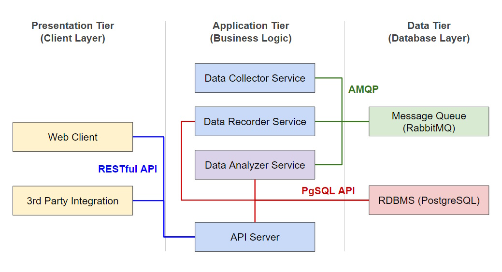

# StockView Project

Welcome to the StockView Project, an innovative solution designed to provide comprehensive and real-time stock market analysis. This project aims to meet the diverse needs of users, ranging from individual investors to financial analysts, by offering a robust platform for accessing, storing, analyzing, and visualizing stock data.

## Project Overview

The StockView Project is structured into several components, each responsible for a specific function within the system. The core components include data collection, data storage, data analysis, RESTful API access, and backend service management, all integrated seamlessly through a message queue system.

## Documentation

For detailed information on the system's design and how to install and use it, please refer to the following documentation:

### [System Design](docs/system_design.md)

<a href="docs/system_design.md">
    
</a>

The System Design of StockVision follows a three-tier architecture to efficiently manage and process stock market data, ensuring scalability and maintainability. The architecture includes the Presentation Tier, Application Tier, and Data Tier. The Presentation Tier comprises the Stock Server, which provides a user-friendly web interface for viewing stock data and analysis results. This tier ensures that users can easily interact with the system, visualize trends, and make informed decisions. The web interface is designed to be responsive and intuitive, providing real-time access to stock information.

The Application Tier handles the business logic and includes services such as the Data Collector, Data Recorder, Data Analyzer, and API Server. These services work together to fetch, store, analyze, and provide programmatic access to stock data. The Data Tier, consisting of a PostgreSQL database and RabbitMQ message broker, manages data storage and communication between services. The PostgreSQL database securely stores stock data, analysis results, and user information, while RabbitMQ facilitates smooth message exchanges between the services, ensuring efficient and reliable data processing. This three-tier design ensures that StockVision is robust, scalable, and capable of handling complex stock market analysis tasks effectively.

### [Installation Guide](docs/installation.md)

Follow the step-by-step guide to install and configure the StockView system on your local machine or server.

## Major Features

### [Data Collection](src/collector/data_collector.py)

The Data Collector Service fetches real-time stock data from the Yahoo Finance API at regular intervals, ensuring users always have access to the latest market information.

### [Data Storage](src/recorder/data_recorder.py)

The Data Recorder Service consumes stock data from RabbitMQ and stores it securely in a PostgreSQL database, ensuring that all data is managed and retrievable.

### [Data Analysis](src/analyzer/data_analyzer.py)

The Data Analyzer Service processes the collected stock data, performing various analyses, such as calculating moving averages, and storing the results back into the PostgreSQL database.

### [RESTful API](src/api/api_server.py)

The API Server provides a RESTful API to programmatically access stock data and analysis results, enabling seamless integration with other applications and services.

### [Backend Service](src/backend.py)

The Backend Service manages the orchestration of data collection, storage, analysis, and API access, ensuring smooth and efficient operation of the entire system.

### [Message Queue Integration](tests/test_rabbitmq.py)

The integration with RabbitMQ facilitates efficient communication between the various services, allowing for scalable and reliable message exchanges.

### [Unit Tests](tests/)

Comprehensive unit tests ensure the reliability and correctness of the system. These tests cover all major components and functionalities, providing confidence in the system's performance.

## Source Tree

The StockVision project is organized into a clear and structured source tree, facilitating easy navigation and management of the various system components. Here is an overview of the source tree and the purpose of each directory:

```plaintext
StockVision/
├── config/
├── src/
│   ├── collector/
│   ├── recorder/
│   ├── analyzer/
│   ├── server/
│   │   ├── static/
│   │   │   ├── css/
│   │   │   ├── js/
│   │   ├── templates/
│   ├── api/
│   ├── db/
│   ├── utils/
├── tests/
└── docs/
```

This source tree provides a clear and organized structure for the StockVision project, making it easier to navigate and manage the different components of the system.

| **Folder**                | **Description**                                                                 |
|---------------------------|---------------------------------------------------------------------------------|
| `/config/`                | Contains configuration files for the application, such as `config.json`.        |
| `/src/`                   | Main source directory for the project, containing all the primary service components. |
| `/src/collector/`         | Contains the Data Collector Service, responsible for fetching stock data.       |
| `/src/recorder/`          | Contains the Data Recorder Service, responsible for storing the collected data into the database. |
| `/src/analyzer/`          | Contains the Data Analyzer Service, responsible for analyzing the stored stock data. |
| `/src/server/`            | Contains the Stock Server, providing a web interface to display stock data and analysis results. |
| `/src/server/static/`     | Contains static files for the web server.                                       |
| `/src/server/static/css/` | Contains CSS files for styling the web interface.                               |
| `/src/server/static/js/`  | Contains JavaScript files for client-side functionality.                        |
| `/src/server/templates/`  | Contains HTML templates for rendering web pages.                                |
| `/src/api/`               | Contains the API Server, providing a RESTful API for accessing stock data and analysis results. |
| `/src/db/`                | Contains database-related files, such as schema definitions.                    |
| `/src/utils/`             | Contains utility scripts and modules used by various services.                  |
| `/tests/`                 | Contains unit tests and integration tests for the various components of the system. |
| `/docs/`                  | Contains documentation files, such as design documents, API documentation, user guides, and installation guides. |

This structured organization ensures that each component of the StockVision system is logically separated, making development, maintenance, and scaling of the project more manageable.

## Getting Started

To get started with the StockView Project, please follow the instructions provided in the [Installation Guide](docs/installation.md). This guide will walk you through the process of setting up the environment, configuring the system, and running the various services to start analyzing stock data.

For more detailed information on each component and its functionalities, refer to the corresponding sections in the documentation. If you encounter any issues or have questions, please feel free to reach out to the project maintainers for assistance. Happy investing!

